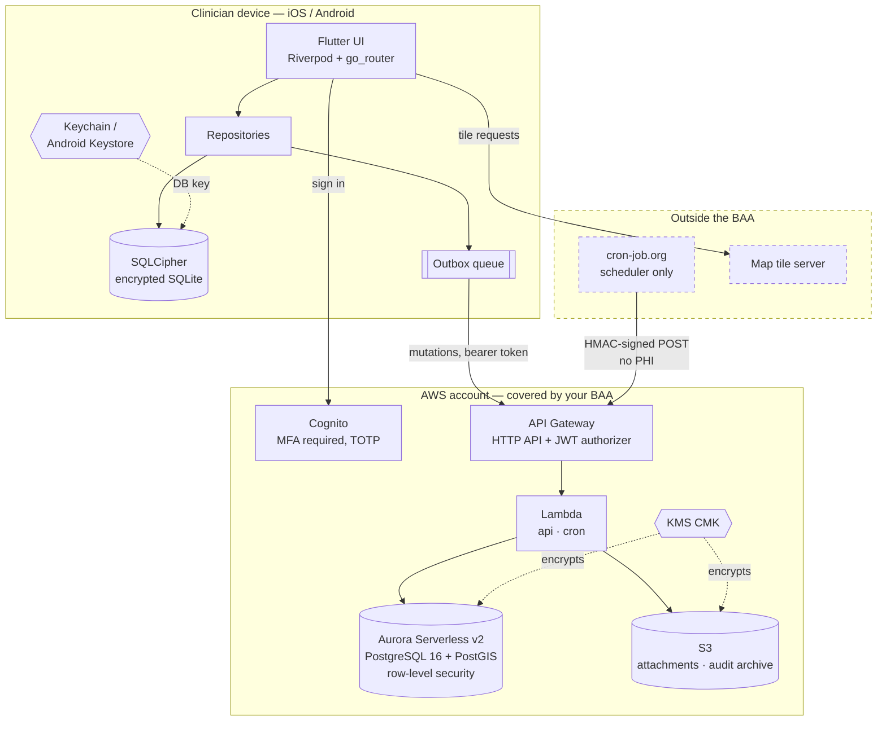
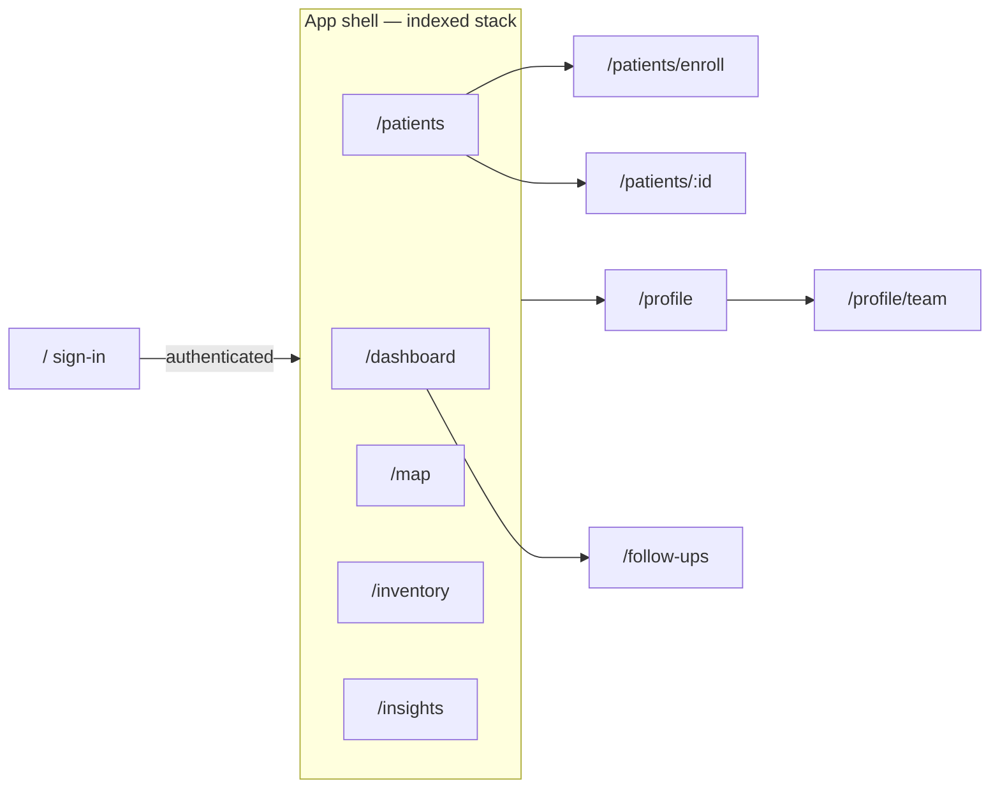
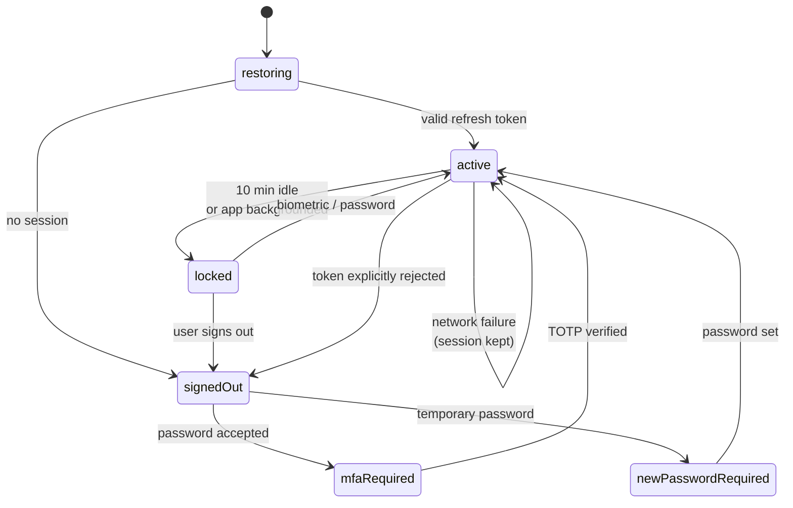
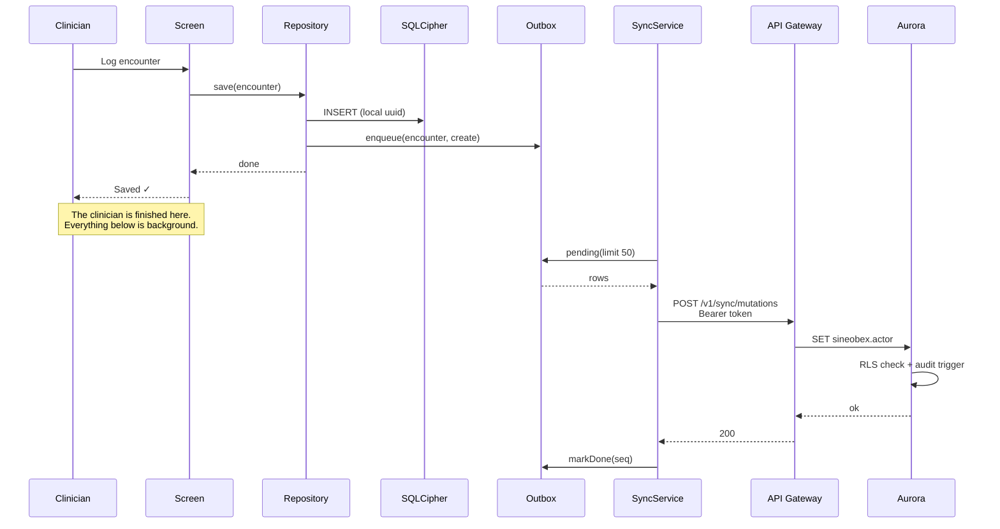
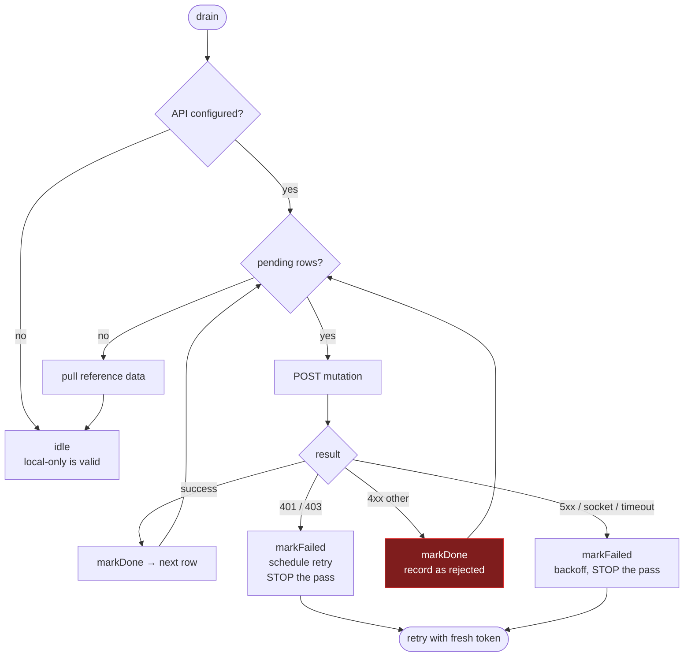
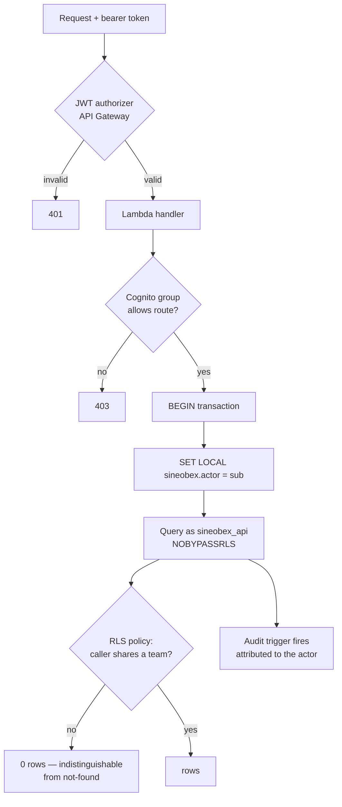
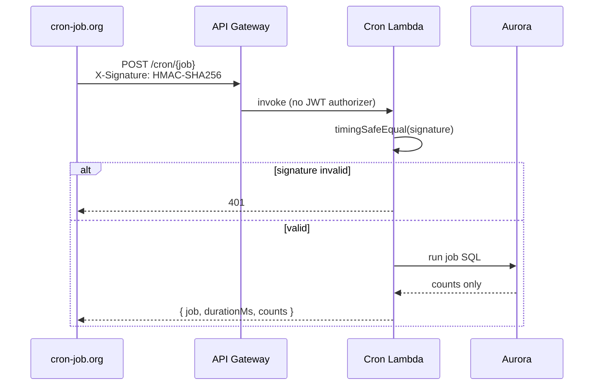
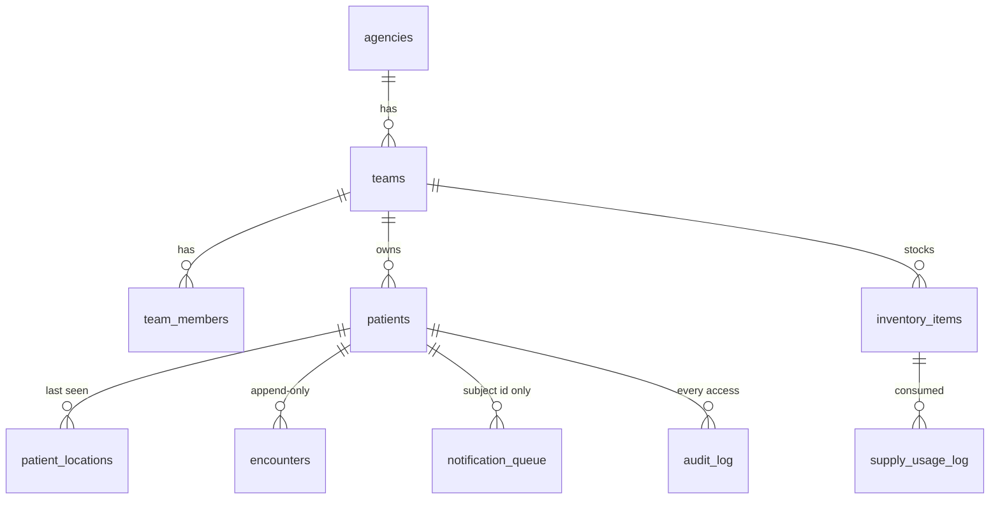
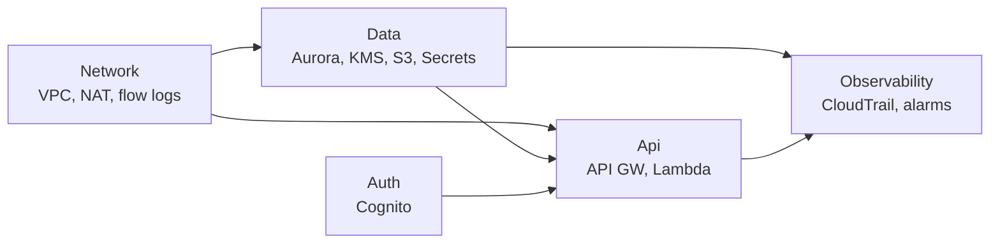
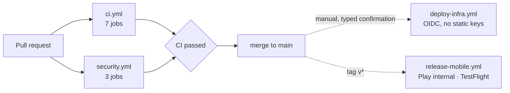

# Architecture

How Sineobex is put together and how data actually moves through it.

> **This is a living document.** It describes the system as it exists on
> `main` today, not a target state. Every diagram below is drawn from code that
> is in the repository right now. When you change the shape of the system,
> change this file in the same pull request — a diagram that quietly stops
> matching the code is worse than no diagram, because people trust it.
>
> `docs/check-architecture.sh` runs in CI and fails if the route lists, cron
> job names, or navigation paths here drift from the source. It catches names
> going stale; it cannot tell whether a diagram still describes reality. That
> part is on the reviewer.

**Last verified against:** `main`, 2026-08-21.

## Which section to update when you change something

| If you change… | Update |
|---|---|
| `app/lib/core/router/app_router.dart` | §2 Navigation |
| `app/lib/features/auth/session_controller.dart` | §3 Session lifecycle |
| `app/lib/data/sync/` | §4 The write path, §5 Sync drain |
| `infra/lib/api-stack.ts` routes | §6 Request path |
| `infra/lambda/cron/index.ts` jobs | §7 Scheduled refresh |
| `infra/migrations/*.sql` | §8 Data model |
| `infra/lib/*-stack.ts` | §1 System context, §9 Deployment |
| `.github/workflows/` | §9 Deployment |

---

## 1. System context

Everything that exists at runtime, and every boundary data crosses.

**Two boundaries worth staring at.**

`cron-job.org` is a scheduler and nothing more. It holds an HMAC secret and
fires a URL; no patient data is in the request or the response. That is what
keeps it outside the BAA without being a problem.

The tile server is a problem, and is currently unresolved. See §10.

---

## 2. Navigation

Five bottom-tab branches in a `StatefulShellRoute.indexedStack`, so each tab
keeps its own navigation stack. Two routes live outside the shell.

A locked session renders the lock screen over whatever route is current, so
unlocking returns the clinician to where they were rather than to the
dashboard — mid-encounter, that matters.

---

## 3. Session lifecycle

`SessionController` owns this. The transitions that are easy to get wrong are
the ones that destroy local data, so they are drawn explicitly.

**`locked` is not `signedOut`.** Locking hides the UI and leaves the encrypted
database intact. Signing out deletes the local rows *and* destroys the
SQLCipher key, making residual blocks unrecoverable.

Only an explicitly rejected refresh token — `NotAuthorizedException`,
`UserNotFoundException`, `UserNotConfirmedException` — signs the user out. A
network failure keeps the session, because wiping the database on a dead-zone
timeout would destroy unsynced field encounters.

---

## 4. The write path

The core of an offline-first design: the local write is the transaction, and
the server catches up later.

The UI never waits on the network. A clinician in a basement with no signal
gets the same interaction as one on wifi, and the record is durable either way
because it is already committed to the encrypted local database.

**Encounters are append-only** at three levels: the client offers no edit path,
the sync handler uses `ON CONFLICT DO NOTHING`, and the table carries
`DO INSTEAD NOTHING` rules. A correction is a later encounter, never a rewrite.

---

## 5. Sync drain — error classification

This is the subtlest logic in the app, and the place a bug costs clinical
records. The drain loop *deletes* rows it considers permanently failed, so
how a failure is classified decides whether data survives.

**401 and 403 are retryable, not permanent.** An expired session must never be
able to erase an encounter that never reached the server. This was a real bug:
auth failures were classified permanent, and the drain loop deleted unsynced
clinical records on session expiry. `app/test/sync_test.dart` now asserts it.

The red path is the only one that discards a row. It fires when the server
rejects a payload it will always reject — and it is surfaced through
`_rejected` rather than dropped silently, because that is real data loss.

Every failure increments the attempt counter before backing off. If it did not,
the retry timer would spin at its floor forever with one bad row blocking every
write queued behind it.

---

## 6. Request path and trust boundaries

What has to be true for a row to come back.

Four independent things must hold, and no single mistake defeats them all:

1. The token is valid (API Gateway, before any code runs).
2. The caller's group permits the route (`lambda/shared/http.ts`).
3. `sineobex.actor` is set — **if a handler forgets, RLS returns zero rows**,
   so the failure mode is a blank screen, not a leak.
4. The connection is `sineobex_api`, which is `NOBYPASSRLS NOSUPERUSER`.

Point 4 is load-bearing. The first draft connected as the Aurora master user,
which bypasses RLS entirely — every policy present in the schema and none of
them doing anything. Migration 002 now raises an exception and aborts if the
role could ever bypass RLS.

Not-found and not-authorised are deliberately indistinguishable: a
distinguishable 404 confirms a patient exists to someone not entitled to know.

### The API surface

Seven authenticated routes, plus the HMAC-verified cron route from §7.

| Method | Route | Purpose |
|---|---|---|
| `GET` | `/v1/reference` | Server-owned reference data — resources, hotspots, rollups |
| `GET` | `/v1/insights` | Aggregated figures for the insights screen |
| `GET` | `/v1/patients` | Caseload for the caller's teams, RLS-scoped |
| `POST` | `/v1/patients/lookup` | Fetch one patient **by id in the body** |
| `POST` | `/v1/sync/mutations` | The outbox drain target |
| `POST` | `/v1/audit` | Client-observed access events |
| `POST` | `/v1/attachments/presign` | Presigned S3 upload URL |

Patient lookup is a `POST` rather than `GET /v1/patients/{id}` on purpose. An
identifier in a URL path lands in API Gateway access logs, CloudFront logs, and
browser history — all retained far longer than the request itself.

---

## 7. Scheduled refresh

Six jobs, all owned by the server. The device only reads what they produce.

| Job | Produces |
|---|---|
| `analytics-rollup` | `analytics_rollups` — dashboard and insights figures |
| `hotspot-recompute` | `hotspots` — encounter density clusters |
| `seasonal-demand` | `seasonal_demand` — supply forecasting |
| `followup-due` | `notification_queue` rows for due follow-ups |
| `low-stock-alert` | `notification_queue` rows for depleted inventory |
| `audit-archive` | Audit rows into S3 under Object Lock |

**No PHI crosses this boundary.** cron-job.org sees a job name, a duration, and
row counts. It never sees a patient. `infra/test/30_cron_queries.sql` asserts
that every job query emits no patient identifiers, and that a second run is
idempotent.

Notification rows carry a subject id only — never a name or a condition.
"Follow-up due: Jane Smith, prenatal" on a lock screen in a shared van is a
disclosure.

---

## 8. Data model

Sixteen tables. What matters most is which ones RLS protects.

| Group | Tables | Protection |
|---|---|---|
| **Patient-identifying** | `patients`, `patient_locations`, `encounters` | **RLS enforced** — team isolation |
| Team-scoped | `teams`, `team_members`, `inventory_items`, `supply_usage_log`, `team_tasks`, `outreach_actions` | Application-level scoping |
| Server-owned | `analytics_rollups`, `hotspots`, `seasonal_demand`, `resources` | Written by cron only |
| Append-only | `encounters`, `audit_log` | `DO INSTEAD NOTHING` rules |

`DELETE` is revoked on every table for `sineobex_api`. Patients are
soft-deleted.

**Two timestamps, deliberately.** `updated_at` is forced to server time by a
trigger and drives the sync cursor. `client_updated_at` carries the device
clock and is used only for last-writer-wins. Collapsing them lets a device with
a skewed clock either win conflicts it should lose or corrupt the cursor and
skip records.

### On the device

Drift over SQLCipher, keyed from the OS keystore. Nine tables: seven mirroring
the server subset the app needs (patients, encounters, inventory, resources,
hotspots, supply log, audit), plus `outbox_rows` (the queue) and
`key_value_rows` (sync cursors).

On web there is no SQLCipher, so the build falls back to an in-memory WASM
database. **No PHI is written to disk on web** — that is the point, not a
limitation.

---

## 9. Deployment

Five CDK stacks, deployed in dependency order.

**Migrations are deliberately not run by CI.** The database has no internet
route, and a schema change against a system holding PHI should be a person at a
terminal with the runbook open.

Neither store's production track is reachable from CI. Promoting a build to
clinicians should take a person deciding to.

---

## 10. Known architectural gaps

Kept here so the diagrams are not read as a clean bill of health. The
authoritative list is `HIPAA.md` §4.

| Gap | Consequence |
|---|---|
| **Map tiles fetched from a third-party CDN by default** | Tile requests disclose approximate patient locations to a party with no BAA. Release builds are gated on `SINEOBEX_TILE_URL`, but the default is unfixed. See `SETUP.md` §6 |
| **Never run on physical hardware** | Both platforms compile in CI. SQLCipher against the real Keychain and Android Keystore, biometrics, GPS, and intermittent connectivity are all unexercised |
| **Attachment upload scaffolded, not finished** | The presign route and bucket exist; the capture flow does not |
| **Notifications queued, not delivered** | `notification_queue` fills; no push provider drains it |
| **No break-glass audit alerting** | Anomalous access lands in the audit log and nothing watches it |
| **RLS covers three tables** | Inventory is not patient-identifying today. If it ever gains per-patient attribution it needs a policy |
